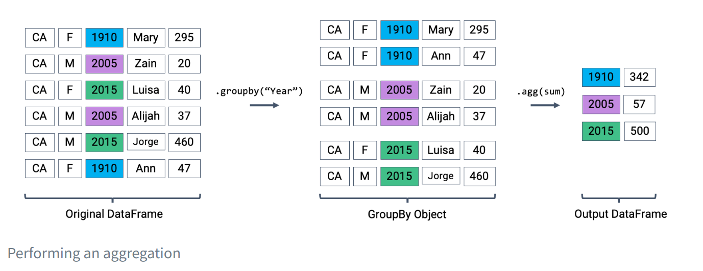

# 1 Introduction

## 1.1 Data Science Lifecycle


### 1.1.1 Ask a Question

问问题的关键在于清楚

- What do we want to know?
  - A question that is too ambiguous may lead to confusion.
- What problems are we trying to solve?
  - The goal of asking a question should be clear in order to justify your efforts to stakeholders.
- What are the hypotheses we want to test?
  - This gives a clear perspective from which to analyze final results.
- What are the metrics for our success?
  - This establishes a clear point to know when to conclude the project.

### 1.1.2 Obtain Data

注意数据单位，数据是否有代表性

- What data do we have, and what data do we need?
  - Define the units of the data (people, cities, points in time, etc.) and what features to measure.
- How will we sample more data?
  - Scrape the web, collect manually, run experiments, etc.
- Is our data representative of the population we want to study?
  - If our data is not representative of our population of interest, then we can come to incorrect conclusions.

Key procedures: *data acquisition*, *data cleaning*

### 1.1.3 Understand the Data

理解数据对数据进行处理

- How is our data organized, and what does it contain?
  - Knowing what the data says about the world helps us better understand the world.
- Do we have relevant data?
  - If the data we have collected is not useful to the question at hand, then we must collect more data.
- What are the biases, anomalies, or other issues with the data?
  - These can lead to many false conclusions if ignored, so data scientists must always be aware of these issues.
- How do we transform the data to enable effective analysis?
  - Data is not always easy to interpret at first glance, so a data scientist should strive to reveal the hidden insights.

Key procedures: *exploratory data analysis*, *data visualization*.

### 1.1.4 Understand the World

- What does the data say about the world?
  - Given our models, the data will lead us to certain conclusions about the real world.
- Does it answer our questions or accurately solve the problem?
  - If our model and data can not accomplish our goals, then we must reform our question, model, or both.
- How robust are our conclusions and can we trust the predictions?
  - Inaccurate models can lead to false conclusions.

Key procedures: *model creation*, *prediction*, *inference*.

# 2 Pandas I

## 2.2 `Series`, `DataFrame`s, and Indices

pandas中有三种基本的数据结构：

1.**`Series`**: 1D labeled array data; best thought of as columnar data.

2.**`DataFrame`**: 2D tabular data with rows and columns.

3.**`Index`**: A sequence of row/column labels.


### 2.2.1 Series

Series表示DataFrame的一列;更一般地说，它可以是任何一维的类似数组的对象。它包含：

1.相同类型的值的序列

2.称为索引的数据标签序列

```python
s = pd.Series(["welcome", "to", "data 100"])

# Accessing data values within the Series
s.values

# Accessing the Index of the Series
s.index

# 默认情况下，Series的索引是从0开始的整数的顺序列表
# 可以将手动指定的所需索引列表传递给index参数
s = pd.Series([-1, 10, 2], index = ["a", "b", "c"])

# 索引也可以在初始化后更改
s.index = ["first", "second", "third"]
```

#### 2.2.1.1 Selection in `Series`

```python
s = pd.Series([4, -2, 0, 6], index = ["a", "b", "c", "d"])

# A Single Label
# We return the value stored at the index label "a"
s["a"] 

# A List of Labels
# We return a Series of the values stored at the index labels "a" and "c"
s[["a", "c"]] 

# A Filtering Condition
s[s > 0] 
```

### 2.2.2 `DataFrames`

我们可以将DataFrame视为所有共享同一索引的Series的集合

#### 2.2.2.1 Creating a `DataFrame`

```python
# More generally, the syntax for creating a DataFrame is:
pandas.DataFrame(data, index, columns)

# 1.From a CSV file
elections = pd.read_csv("data/elections.csv")

# 2. Using a List and Column Name(s)
df_list = pd.DataFrame([1, 2, 3], columns=["Numbers"])

df_list = pd.DataFrame([[1, "one"], [2, "two"]], columns = ["Number", "Description"])

# 3.From a Dictionary
df_dict = pd.DataFrame({
    "Fruit": ["Strawberry", "Orange"], 
    "Price": [5.49, 3.99]
})

df_dict = pd.DataFrame(
    [
        {"Fruit":"Strawberry", "Price":5.49}, 
        {"Fruit": "Orange", "Price":3.99}
    ]
)

# 4.From a Series
# Notice how our indices, or row labels, are the same
s_a = pd.Series(["a1", "a2", "a3"], index = ["r1", "r2", "r3"])
s_b = pd.Series(["b1", "b2", "b3"], index = ["r1", "r2", "r3"])

pd.DataFrame(s_a)

s_b.to_frame()

# To merge the two Series and specify their column names
pd.DataFrame({
    "A-column": s_a, 
    "B-column": s_b
})
```

### 2.2.3 Indices

```python
# 从技术角度来说，索引不必是整数，也不必是唯一的
# Creating a DataFrame from a CSV file and specifying the index column
elections = pd.read_csv("data/elections.csv", index_col = "Candidate")

# 我们还可以选择一个新列并将其设置为DataFrame的索引
elections.reset_index(inplace = True) # Resetting the index so we can set it again
# This sets the index to the "Party" column
elections.set_index("Party")

# 我们可以将索引恢复为默认的整数列表
# This resets the index to be the default list of integer
elections.reset_index(inplace=True) 

```

## 2.3 `DataFrame` Attributes: Index, Columns, and Shape

```python
# For index/row labels, use DataFrame.index
elections.set_index("Party", inplace = True)

# For column labels, use DataFrame.columns:
elections.columns

# 对于DataFrame的形状，我们可以使用DataFrame.shape来获取行数和列数
elections.shape
```

## 2.4 Slicing in `DataFrame`s

We will do so with four primary methods of the `DataFrame` class:

1. `.head` and `.tail`
2. `.loc`
3. `.iloc`
4. `[]`

### 2.4.1 Extracting data with `.head` and `.tail`

```python
# Extract the first 5 rows of the DataFrame
elections.head(5)

# Extract the last 5 rows of the DataFrame
elections.tail(5)
```

### 2.4.2 Label-based Extraction: Indexing with `.loc`

要使用.loc抓取数据，我们必须指定数据所在的行和列标签。行标签是.loc函数的第一个参数;列标签是第二个参数

Arguments to `.loc` can be:

- A single value.
- A slice.
- A list.

```python
elections.loc[0, 'Candidate']

# 传入一个参数作为单个值将产生一个Series
elections.loc[[87, 25, 179], "Popular vote"]

# 如果我们将“Popular vote”作为列表传递，则输出将是DataFrame
elections.loc[[87, 25, 179], ["Popular vote"]]

# 要选择多个行和列，我们可以使用Python切片表示法
# 与Python切片不同，.loc包含右上界
elections.loc[0:3, 'Year':'Popular vote']

# 我们要提取前四行的所有列值使用:
elections.loc[0:3, :]
```

### 2.4.3 Integer-based Extraction: Indexing with `.iloc`

使用.iloc进行切片的工作原理与. loc类似。但是，.iloc使用行和列的索引位置，而不是标签

切片在.iloc中不再是包容性的-它是排他性的。换句话说，使用. iloc时不包括切片的右端

### 2.4.4 Context-dependent Extraction: Indexing with

```python
# A slice of row numbers
# 前四行
elections[0:4]

# A slice of row numbers
# 前四列
elections[["Year", "Candidate", "Party", "Popular vote"]]

# A single-column label
elections["Candidate"]
```


# 3 Pandas II

# 4 Pandas III

## 4.1 Custom Sorts

### 4.1.1 Approach 1: Create a Temporary Column

```python
# Create a Series of the length of each name
babyname_lengths = babynames["Name"].str.len()

# Add a column named "name_lengths" that includes the length of each name
babynames["name_lengths"] = babyname_lengths
babynames.head(5)

# Sort by the temporary column
babynames = babynames.sort_values(by="name_lengths", ascending=False)
babynames.head(5)

# Drop the 'name_length' column
babynames = babynames.drop("name_lengths", axis='columns')
babynames.head(5)
```

### 4.1.2 Approach 2: Sorting using the `key` Argument

```python
babynames.sort_values("Name", key=lambda x: x.str.len(), ascending=False).head()
```

### 4.1.3 Approach 3: Sorting using the `map` Function

我们也可以在Series上使用map函数来解决这个问题。假设我们想要按照每个“Name”中的“dr”和“ea”的数量对babynames表进行排序。

```python
# First, define a function to count the number of times "dr" or "ea" appear in each name
def dr_ea_count(string):
    return string.count('dr') + string.count('ea')

# Then, use `map` to apply `dr_ea_count` to each name in the "Name" column
babynames["dr_ea_count"] = babynames["Name"].map(dr_ea_count)

# Sort the DataFrame by the new "dr_ea_count" column so we can see our handiwork
babynames = babynames.sort_values(by="dr_ea_count", ascending=False)
babynames.head()

# Drop the `dr_ea_count` column
babynames = babynames.drop("dr_ea_count", axis = 'columns')
babynames.head(5)
```

## 4.2 Aggregating Data with `.groupby`

```python
babynames.groupby("Year")
```


调用.groupby（documentation）生成了一个GroupBy对象。我们不能直接使用GroupBy对象，需要调用一个聚合方法。这个方法告诉pandas如何聚合GroupBy对象中的值。一旦应用了聚合，pandas将返回一个普通的（现在是分组的）DataFrame。

```python
babynames[["Year", "Count"]].groupby("Year").agg("sum").head(5)
```



```python
babynames[["Year", "Count"]].groupby("Year").agg("min").head(5)

babynames[["Year", "Count"]].groupby("Year").agg("max").head(5)

# Same result, but now we explicitly tell pandas to only consider the "Count" column when summing
babynames.groupby("Year")[["Count"]].agg("sum").head(5)
```

### 4.2.1 Aggregation Functions

```python
# What is the minimum count for each name in any year?
babynames.groupby("Name")[["Count"]].agg("min").head()

# What is the largest single-year count of each name?
babynames.groupby("Name")[["Count"]].agg("max").head()

# What is the average count for each name across all years?
babynames.groupby("Name")[["Count"]].agg("mean").head()
```

- `.agg("sum")`
- `.agg("max")`
- `.agg("min")`
- `.agg("mean")`
- `.agg("first")`
- `.agg("last")`

考虑一个组中的多个列共享相同信息的情况。为了在分组输出中表示这些信息，我们可以简单地抓取第一个或最后一个条目，我们知道这将与所有其他条目相同。

```python
# Imagine we had an additional column, "First Letter". We'll explain this code next week
babynames["First Letter"] = babynames["Name"].str[0]

# We construct a simplified DataFrame containing just a subset of columns
babynames_new = babynames[["Name", "First Letter", "Year"]]
babynames_new.head()

babynames_new.groupby("Name").agg({"First Letter":"first", "Year":"max"}).head()
```


### 4.2.2 Plotting Birth Counts

```python
babynames.groupby("Year")[["Count"]].agg(sum).head(5)
# Alternative 1
# babynames.groupby("Year")[["Count"]].sum()
# Alternative 2
# babynames.groupby("Year").sum(numeric_only=True)

import plotly.express as px
puzzle2 = babynames.groupby("Year")[["Count"]].agg("sum")
px.line(puzzle2, y = "Count")
```


### 4.2.4 Revisiting the `.agg()` Function

可以自定义方法

```python
# We filter by babies with sex "F" and sort by "Year"
f_babynames = babynames[babynames["Sex"] == "F"]
f_babynames = f_babynames.sort_values(["Year"])

# Determine how many Jennifers were born in CA per year
jenn_counts_series = f_babynames[f_babynames["Name"] == "Jennifer"]["Count"]

# Determine the max number of Jennifers born in a year and the number born in 2022 
# to calculate RTP
max_jenn = max(f_babynames[f_babynames["Name"] == "Jennifer"]["Count"])
curr_jenn = f_babynames[f_babynames["Name"] == "Jennifer"]["Count"].iloc[-1]
rtp = curr_jenn / max_jenn
rtp

# 自定义

def ratio_to_peak(series):
    return series.iloc[-1] / max(series)

#Using .groupby() to apply the function
rtp_table = f_babynames.groupby("Name")[["Year", "Count"]].agg(ratio_to_peak)
rtp_table.head()
```

### 4.2.6 Renaming Columns After Grouping

默认情况下，.groupby不会重命名任何聚合列

```python
rtp_table = rtp_table.rename(columns = {"Count": "Count RTP"})
rtp_table
```

### 4.2.7 Some Data Science Payoff

```python
import plotly.express as px
px.line(f_babynames[f_babynames["Name"] == "Debra"], x = "Year", y = "Count")
```


```python
top10 = rtp_table.sort_values("Count RTP").head(10).index
px.line(
    f_babynames[f_babynames["Name"].isin(top10)], 
    x = "Year", 
    y = "Count", 
    color = "Name"
)
```


## 4.3 `.groupby()`, Continued

### 4.3.1 Raw `GroupBy` Objects

查看DataFrameGroupBy对象的几种方法

```python
grouped_by_year = elections.groupby("Year")
type(grouped_by_year)

grouped_by_party = elections.groupby("Party")
grouped_by_party.groups

grouped_by_party.get_group("Socialist")
```

### 4.3.2 Other `GroupBy` Methods

There are many aggregation methods we can use with `.agg`. Some useful options are:

- [`.mean`](https://pandas.pydata.org/docs/reference/api/pandas.core.groupby.DataFrameGroupBy.mean.html#pandas.core.groupby.DataFrameGroupBy.mean): creates a new `DataFrame` with the mean value of each group
- [`.sum`](https://pandas.pydata.org/docs/reference/api/pandas.core.groupby.DataFrameGroupBy.sum.html#pandas.core.groupby.DataFrameGroupBy.sum): creates a new `DataFrame` with the sum of each group
- [`.max`](https://pandas.pydata.org/docs/reference/api/pandas.core.groupby.DataFrameGroupBy.max.html#pandas.core.groupby.DataFrameGroupBy.max) and [`.min`](https://pandas.pydata.org/docs/reference/api/pandas.core.groupby.DataFrameGroupBy.min.html#pandas.core.groupby.DataFrameGroupBy.min): creates a new `DataFrame` with the maximum/minimum value of each group
- [`.first`](https://pandas.pydata.org/docs/reference/api/pandas.core.groupby.DataFrameGroupBy.first.html#pandas.core.groupby.DataFrameGroupBy.first) and [`.last`](https://pandas.pydata.org/docs/reference/api/pandas.core.groupby.DataFrameGroupBy.last.html#pandas.core.groupby.DataFrameGroupBy.last): creates a new `DataFrame` with the first/last row in each group
- [`.size`](https://pandas.pydata.org/docs/reference/api/pandas.core.groupby.DataFrameGroupBy.size.html#pandas.core.groupby.DataFrameGroupBy.size): creates a new **`Series`** with the number of entries in each group
- [`.count`](https://pandas.pydata.org/docs/reference/api/pandas.core.groupby.DataFrameGroupBy.count.html#pandas.core.groupby.DataFrameGroupBy.count): creates a new **`DataFrame`** with the number of entries, excluding missing values.

size（）返回一个Series并计算包含缺失值的条目数，.count（）返回一个DataFrame并计算每列中不包含缺失值的条目数。

### 4.3.3 Filtering by Group


```python
elections.groupby("Year").filter(lambda sf: sf["%"].max() < 45).head(9)
```

### 4.3.4 Aggregation with `lambda` Functions

```python
elections_sorted_by_percent.groupby("Party").agg(lambda x : x.iloc[0]).head(10)

# Equivalent to the below code
# elections_sorted_by_percent.groupby("Party").agg('first').head(10)
```


## 4.4 Aggregating Data with Pivot Tables

```python
# Find the total number of baby names associated with each sex for each 
# year in the data
babynames.groupby(["Year", "Sex"])[["Count"]].agg(sum).head(6)

```


```python
# The `pivot_table` method is used to generate a Pandas pivot table
import numpy as np
babynames.pivot_table(
    index = "Year",
    columns = "Sex",    
    values = "Count", 
    aggfunc = "sum", 
).head(5)

babynames_pivot = babynames.pivot_table(
    index="Year",     # the rows (turned into index)
    columns="Sex",    # the column values
    values=["Count", "Name"], 
    aggfunc="max",      # group operation
)
babynames_pivot.head(6)
```

## 4.5 Joining Tables

```python
# This `str` operation splits each candidate's full name at each 
# blank space, then takes just the candidate's first name
elections["First Name"] = elections["Candidate"].str.split().str[0]
elections.head(5)

# Here, we'll only consider `babynames` data from 2022
babynames_2022 = babynames[babynames["Year"]==2022]
babynames_2022.head()

merged = pd.merge(left = elections, right = babynames_2022, \
                  left_on = "First Name", right_on = "Name")
merged.head()
# Notice that pandas automatically specifies `Year_x` and `Year_y` 
# when both merged DataFrames have the same column name to avoid confusion

# Second option
# merged = elections.merge(right = babynames_2022, \
    # left_on = "First Name", right_on = "Name")
```

# 5 Data Cleaning and EDA(**Exploratory Data Analysis**)

## 5.1 Structure

### 5.1.1 File Formats

#### 5.1.1.1 CSV(**Comma-Separated Values**)

#### 5.1.1.2 TSV**(Tab-Separated Values)**

TSVs can be loaded into `pandas` using `pd.read_csv`. We’ll need to specify the **delimiter** with parameter`sep='\t'` [(documentation)](https://pandas.pydata.org/docs/reference/api/pandas.read_csv.html).

```python
pd.read_csv("data/elections.txt", sep='\t').head(3)
```

#### 5.1.1.3 JSON(JavaScript Object Notation)

```python
pd.read_json('data/elections.json').head(3)
```

### 5.1.2 Primary and Foreign Keys

### 5.1.3 Variable Types

Broadly speaking, we can categorize variables into one of two overarching types.

1. **Quantitative variables**
   1. **Continuous quantitative variables**
   2. **Discrete quantitative variables**
2. **Qualitative variables**
   1. **Ordinal qualitative variables**
   2. **Nominal qualitative variables**


Note that many variables don’t sit neatly in just one of these categories. Qualitative variables could have numeric levels, and conversely, quantitative variables could be stored as strings.

## 5.2 Granularity, Scope, and Temporality

We can also do many things with the `dt` accessor like switching time zones and converting time back to UNIX/POSIX time. Check out the documentation on [`.dt` accessor](https://pandas.pydata.org/docs/user_guide/basics.html#basics-dt-accessors) and [time series/date functionality](https://pandas.pydata.org/docs/user_guide/timeseries.html#).

## 5.3 Faithfulness

 that our data accurately captures the “real world.”

Data used in research or industry is often “messy” – there may be errors or inaccuracies that impact the faithfulness of the dataset. Signs that data may not be faithful include:

- Unrealistic or “incorrect” values, such as negative counts, locations that don’t exist, or dates set in the future
- Violations of obvious dependencies, like an age that does not match a birthday
- Clear signs that data was entered by hand, which can lead to spelling errors or fields that are incorrectly shifted
- Signs of data falsification, such as fake email addresses or repeated use of the same names
- Duplicated records or fields containing the same information
- Truncated data, e.g. Microsoft Excel would limit the number of rows to 655536 and the number of columns to 255

We often solve some of these more common issues in the following ways:

- Spelling errors: apply corrections or drop records that aren’t in a dictionary
- Time zone inconsistencies: convert to a common time zone (e.g. UTC)
- Duplicated records or fields: identify and eliminate duplicates (using primary keys)
- Unspecified or inconsistent units: infer the units and check that values are in reasonable ranges in the data
